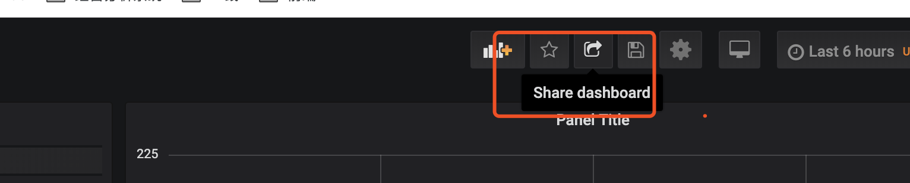

# 导出嵌套网页


## 启动grafna

如下，启动grafna时需要设置允许IFRAME调用GF_SECURITY_ALLOW_EMBEDDING=true

```bash 
docker run \
  -d \
  -p 3000:3000 \
  --name=grafana \
  -e "GF_PANELS_DISABLE_SANITIZE_HTML=true" \
  -e "GF_SECURITY_ALLOW_EMBEDDING=true" \
  -e "GF_SECURITY_ADMIN_PASSWORD=123456" \
    grafana/grafana:6.2.5
```


## 制作dashboard 

* 导入数据源
* 制作dashboard 
* 点击share 发布,生成访问iframe



## 嵌套到网页中使用

```html
<!DOCTYPE html>
<html lang="en">
<head>
    <meta charset="UTF-8">
    <title>Title</title>
</head>
<body>

<iframe
        src="http://localhost:3000/d/VxIkEtDZz/xiao-shou-shou-ru?orgId=1&from=1564787032582&to=1564808632583&kiosk"
        width="700" height="300vw"
        style="background: aqua"></iframe>

<iframe
        src="http://localhost:3000/d/VxIkEtDZz/xiao-shou-shou-ru?orgId=1&from=1564787643919&to=1564809243919&kiosk"
        width="100%" height="600vw"
        style="background: aqua"></iframe>

</body>
</html>
```


## 安全

https://grafana.com/docs/auth/ldap/


