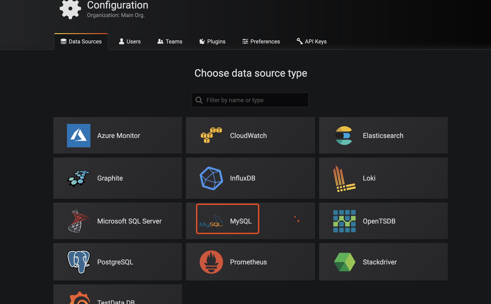
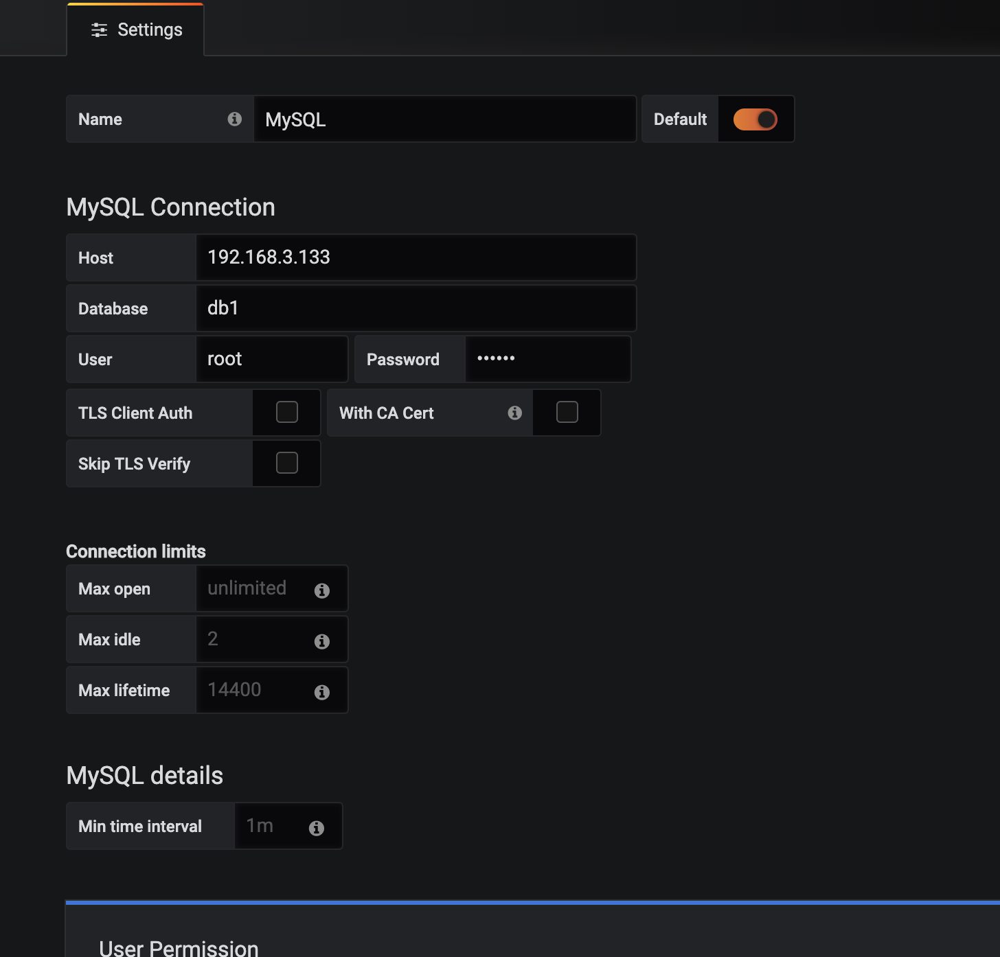

# 快速入门

该教程教我们熟悉grafana，该文假设读者已经安装好了grafana，如果您还没安装，请参考相关安装文献。


## 准备数据库

本文使用Mysql 数据库

```SQL
-- ----------------------------
-- Table structure for sell
-- ----------------------------
DROP TABLE IF EXISTS `sell`;
CREATE TABLE `sell` (
  `id` int(11) NOT NULL,
  `day` varchar(10) DEFAULT NULL,
  `amount` int(20) DEFAULT NULL,
  PRIMARY KEY (`id`)
) ENGINE=MyISAM DEFAULT CHARSET=utf8;

-- ----------------------------
-- Records of sell
-- ----------------------------
BEGIN;
INSERT INTO `sell` VALUES (1, '2019-08-03', 100);
INSERT INTO `sell` VALUES (2, '2019-08-04', 200);
INSERT INTO `sell` VALUES (3, '2019-08-05', 150);
COMMIT;
```


## 首次登录

首次登录地址为 http://localhost:3000/. 3000是默认端口。

默认的用户名和密码为admin,首次登录将会提示修改。

## 添加datasource

在创建第一个dashboard之前，我们需要创建要给数据源


* 按如下按钮给系统添加数据源头  


* 选择mysql 




* 填写mysql信息，保存




## 创建dashboard  


* 创建pannel


* add query

* 设置sql ，如下是一个例子，我们根据自己的情况选择源，设置sql 

```SQL
SELECT
  UNIX_TIMESTAMP(<time_column>) as time_sec,
  <value column> as value,
  <series name column> as metric
FROM <table name>
WHERE $__timeFilter(time_column)
ORDER BY <time_column> ASC
```

```SQL
SELECT
id as time_sec,
amount as value,
day as metric
FROM sell
```
* 选择图像，设置Y轴  


* 保存.


